# AirWatch India — Complete Technical Document

**Urban Air Quality Intelligence Platform**
ET AI Hackathon 2026 · Problem Statement 5
Focus track: **Enforcement Intelligence & Prioritisation**

This document explains the whole system in plain English: what it does, how it is
built, how data flows through it, and how each part behaves. Every diagram below
is written in Mermaid, so it renders as a picture directly on GitHub.

---

## Table of contents

1. [What the project does, in one page](#1-what-the-project-does-in-one-page)
2. [The big idea: the computer decides, the AI narrates](#2-the-big-idea-the-computer-decides-the-ai-narrates)
3. [System architecture](#3-system-architecture)
4. [The technology stack](#4-the-technology-stack)
5. [Data sources and how they are trusted](#5-data-sources-and-how-they-are-trusted)
6. [The enforcement pipeline, step by step](#6-the-enforcement-pipeline-step-by-step)
7. [Activity diagrams](#7-activity-diagrams)
8. [State diagrams](#8-state-diagrams)
9. [How a single emission source is scored](#9-how-a-single-emission-source-is-scored)
10. [The science: Gaussian plume dispersion](#10-the-science-gaussian-plume-dispersion)
11. [Keeping the data honest](#11-keeping-the-data-honest)
12. [The other three agents](#12-the-other-three-agents)
13. [API reference](#13-api-reference)
14. [Code map: where everything lives](#14-code-map-where-everything-lives)
15. [Testing](#15-testing)
16. [Scalability](#16-scalability)
17. [Known limits, stated honestly](#17-known-limits-stated-honestly)

---

## 1. What the project does, in one page

India has over 900 government air quality monitoring stations. The data exists.
What does not exist is a layer that turns a bad reading into an **action** — a
2024 government audit found only 31% of cities with monitoring data had any plan
attached to that data.

A pollution inspector who is told "Delhi's air is bad today" still does not know
**what to do**. Within range of one Delhi monitoring station there are **213
registered emission sources** — factories, construction sites, bus depots, waste
sites. Which one do they visit first, this morning?

**AirWatch answers exactly that question.** For each pollution hotspot it:

1. Reads the live air quality (only if the reading is genuinely recent).
2. Works out *why* the city is polluted (traffic? industry? burning?).
3. Finds every registered emission source near that hotspot.
4. Scores each source by how physically able it is to be causing the reading —
   distance, wind, weather, source type.
5. Hands the top few real facilities to an AI, which writes a dispatch order an
   inspector can act on — with coordinates, evidence, and a map link.

All of this happens in under a minute, and every number behind the decision can
be checked.

The platform also has three supporting features: a live national AQI map, a 24-
hour forecast, and a multilingual citizen health advisory chatbot. But the
enforcement engine is the heart of it.

---

## 2. The big idea: the computer decides, the AI narrates

Most AI projects ask a language model to make the decision. That is exactly what
you cannot defend to an expert, because the model can invent things.

**AirWatch does the opposite.** The decision — *which facility, and why* — is made
by ordinary arithmetic and physics that anyone can check. The AI is called only
at the very end, and only to turn a ranked list of real facilities into readable
instructions. It is handed a shortlist it is **not allowed to change**: it must
pick from the facilities given to it, by their exact ID.

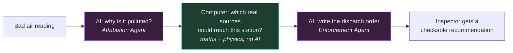

The rule we hold ourselves to: **anything a judge can check is computed;
anything the AI merely asserts is clearly labelled as such.**

---

## 3. System architecture

This is the whole system on one page: where data comes from, what the backend
does with it, and what the user sees.

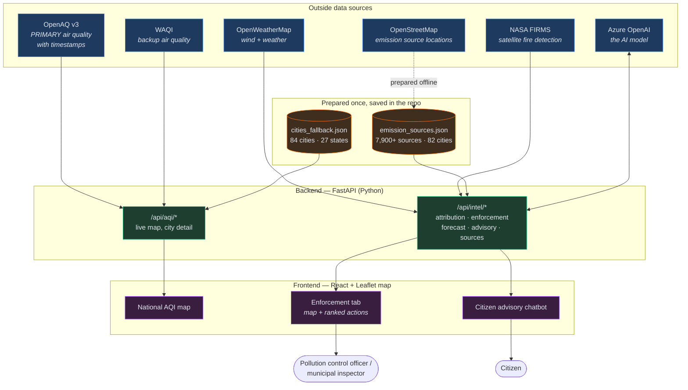

**In words:** the backend pulls live air quality (OpenAQ first, WAQI as backup),
weather, and satellite fire data. It combines these with a pre-built list of
emission sources and a pre-built list of cities. It runs the enforcement logic,
calls the AI where needed, and serves results to a React web app with three tabs.

---

## 4. The technology stack

| Layer | What we used | Why |
|---|---|---|
| **Frontend** | React, Vite, Tailwind CSS, Leaflet.js | Fast interactive map, clean UI |
| **Backend** | FastAPI (Python 3.11), httpx, tenacity | Async web server, reliable API calls with retries |
| **AI** | Azure OpenAI (`gpt-5-nano`), used asynchronously | Writes the human-readable recommendations |
| **Air quality** | OpenAQ v3 (primary) → WAQI (backup) → static file | Timestamped, real μg/m³ readings |
| **Emission sources** | OpenStreetMap via the Overpass API | Free, real coordinates for factories, depots, etc. |
| **Satellite** | NASA FIRMS (VIIRS 375 m) | Finds open burning that no register contains |
| **Weather** | OpenWeatherMap | Wind speed and direction drive the physics |
| **Dispersion science** | Gaussian plume + Pasquill-Gifford stability | Decides if a source can actually reach a station |

The important design property: all the **scoring, physics, and impact maths have
no external dependencies**. That is why the full test suite (162 tests) runs
without any internet connection or API keys.

---

## 5. Data sources and how they are trusted

Every data source is treated as "guilty until proven fresh". Nothing is assumed
to be current just because an API returned it.

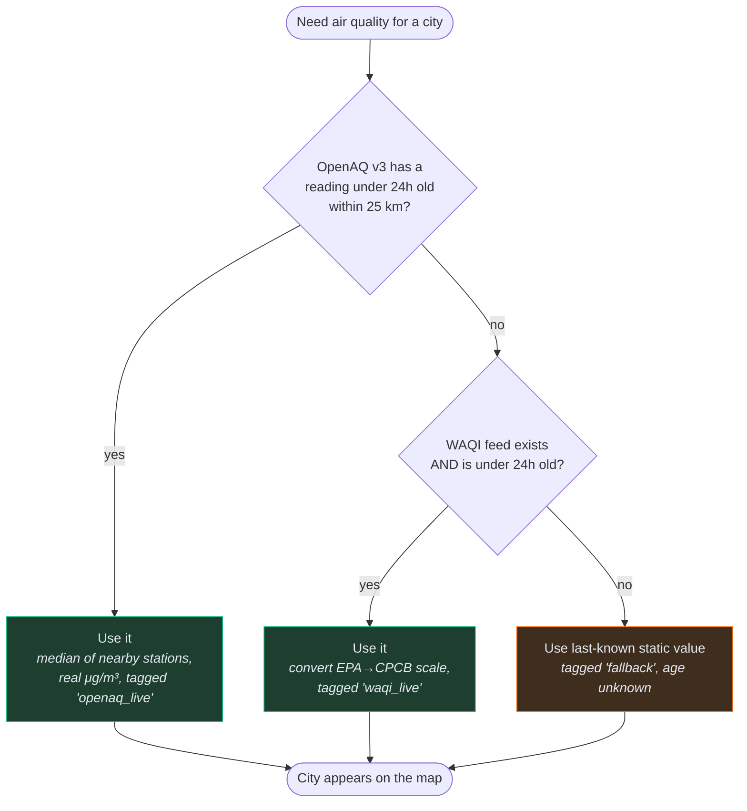

**Why this matters:** the original design used WAQI's feeds and never checked
their age. When we audited all 84 cities, only 4 had a reading under 6 hours old
— the rest were days to **years** stale (one city's feed was 1,710 days old, from
2021). Those stale readings were driving the enforcement recommendations. We
switched to OpenAQ v3 (which timestamps every reading), and now:

- A city only shows as "live" if we can prove its reading is recent.
- A city's AQI is the **median** of its nearby stations, not the maximum, so one
  broken sensor cannot make a city look like an emergency.
- A reading above 500 μg/m³ is thrown out as a stuck sensor.

---

## 6. The enforcement pipeline, step by step

This is the core feature. When someone opens the Enforcement tab, the browser
calls `GET /api/intel/enforcement/auto`, and the backend runs a three-stage chain.

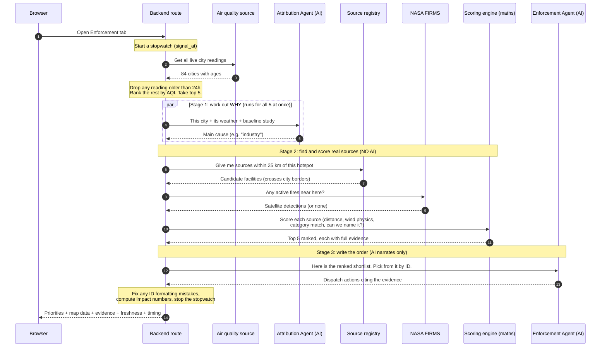

**Plain-English summary of the three stages:**

- **Stage 1 — Attribution (AI).** For each of the 5 worst cities, the AI is asked
  "what is mainly polluting this city right now?" using its live weather and a
  published government source-apportionment study as a starting point. All 5 run
  at the same time (concurrently), so this is fast.
- **Stage 2 — Correlation (pure maths, no AI).** For each hotspot, the system
  pulls every registered emission source within 25 km, adds any satellite fire
  detections, and scores them. This is the part that actually decides the answer.
- **Stage 3 — Narration (AI).** The AI receives the ranked shortlist of real
  facilities and writes the enforcement action for each. It must reference a real
  facility by its exact ID; it cannot make one up.

---

## 7. Activity diagrams

Activity diagrams show the flow of work as a series of actions and decisions.

### 7.1 Overall enforcement activity

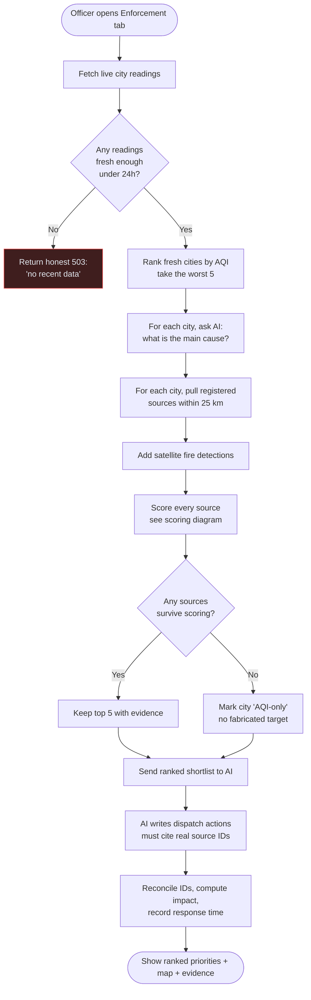

### 7.2 Loading the national map

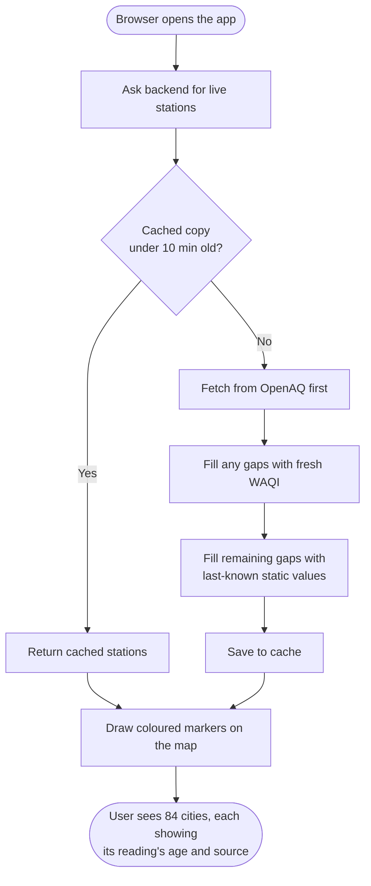

### 7.3 Citizen advisory chatbot

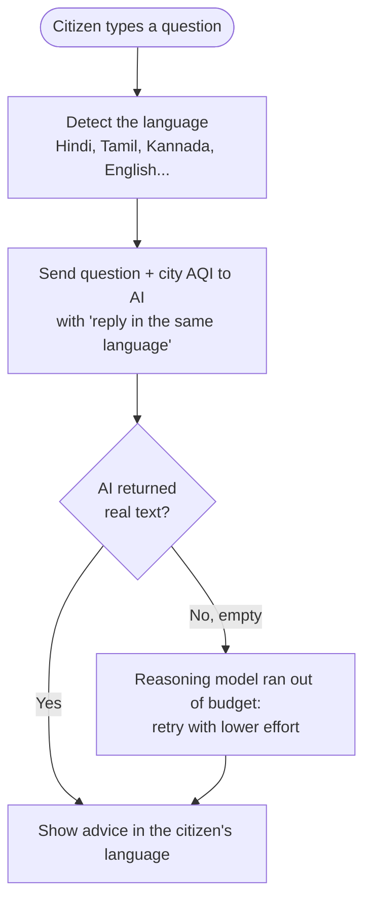

---

## 8. State diagrams

State diagrams show the different conditions a thing can be in, and how it moves
between them.

### 8.1 A single air quality station

This is the heart of the freshness fix. A station is only "Live" if we can prove
its reading is recent.

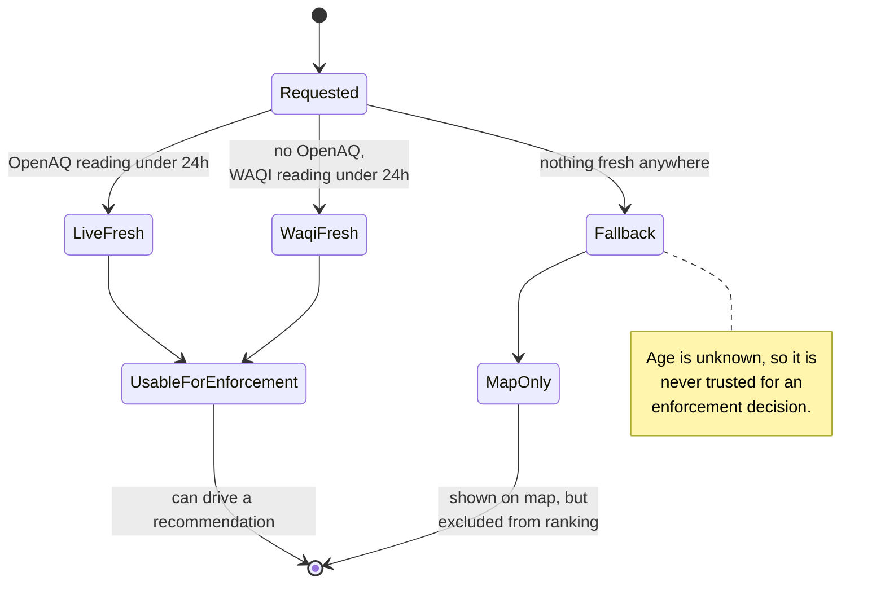

### 8.2 An emission source moving through the scorer

Each source starts as a candidate and is either eliminated or ranked.

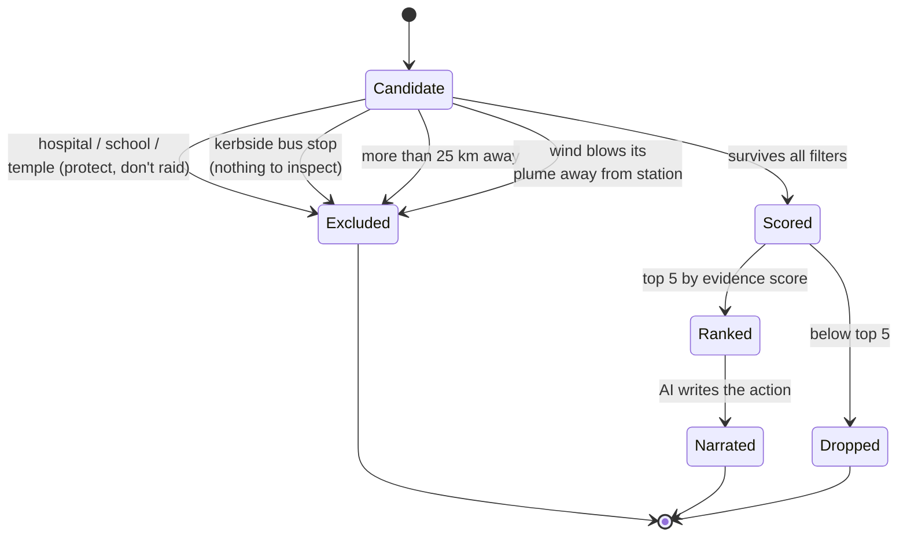

### 8.3 The overall enforcement request

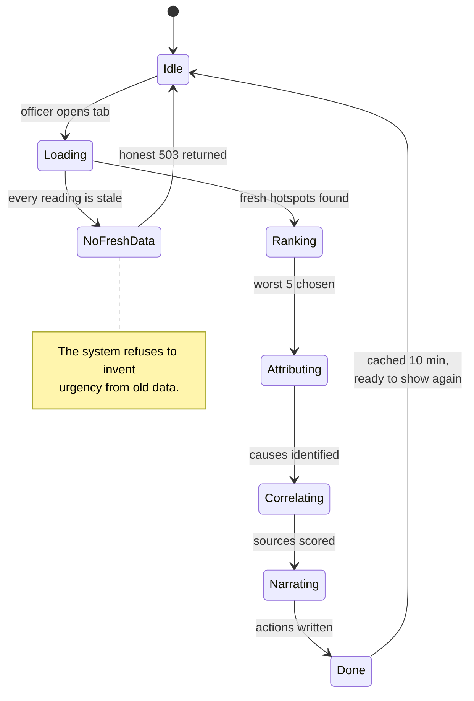

---

## 9. How a single emission source is scored

This is the exact logic that decides which facility an inspector visits. No AI is
involved. Every source that survives the filters gets a score between 0 and 1.

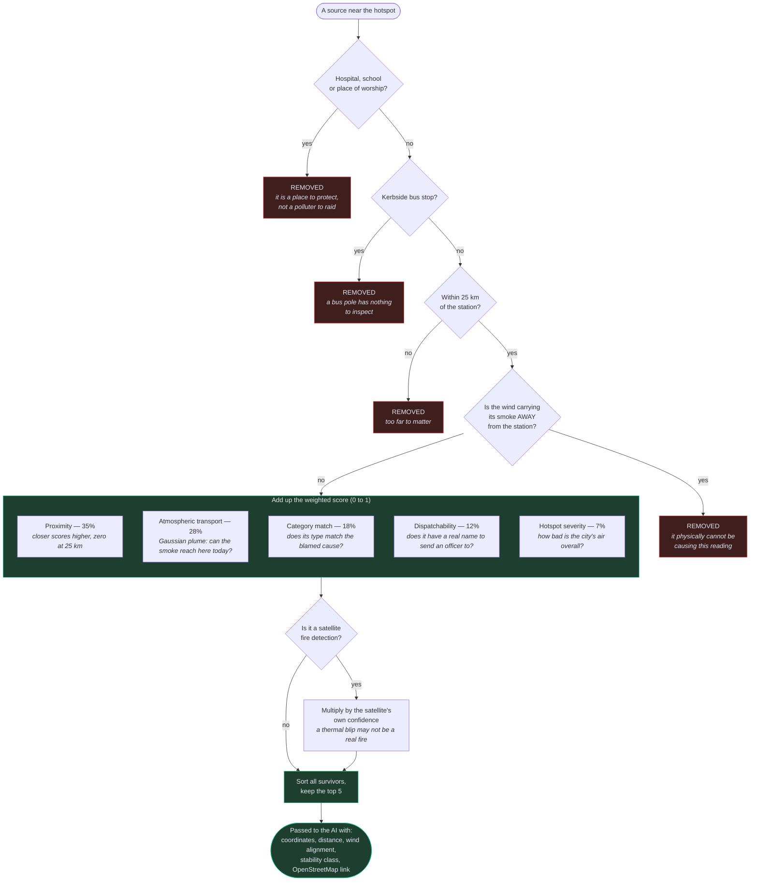

**Why each filter exists:**

- **Hospitals/schools/temples** — OpenStreetMap names a bus stop outside a
  hospital after the hospital. Twice, live, the system recommended raiding "Park
  Circus – Chittaranjan Hospital" and then "Kamakhya Mandir" (a major temple).
  These are now removed before scoring. An order named after a temple is
  indefensible.
- **Kerbside bus stops** — the map data lumps a state bus depot and a numbered
  roadside pole into the same category. A pole has nothing to inspect, so it is
  filtered out (using both its shape on the map and its name).
- **Downwind sources** — if the wind is blowing a factory's smoke *away* from the
  station, that factory cannot be causing the reading. It is removed, not just
  ranked low.

---

## 10. The science: Gaussian plume dispersion

The "atmospheric transport" score is not a guess. It uses the standard textbook
equation for how a plume of pollution spreads through the air.

The idea in plain English: **a source being upwind is not enough.** A small
factory 500 metres away and a large one 20 km away are completely different, and
the same factory matters far more on a still night than on a windy afternoon.

The model uses:

- **Wind speed and direction** (live, from OpenWeatherMap).
- **Atmospheric stability** — is the air still and trapping pollution (a night
  inversion), or churning and mixing it away (a windy day)? This is worked out
  from wind speed and whether the sun is up, using the standard Pasquill-Gifford
  categories (classes A to F).
- **Distance and sideways offset** from the source to the station.

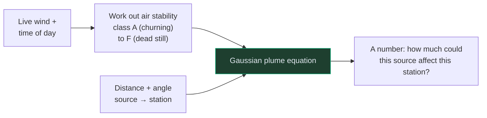

**A concrete example from the live system:** on a calm, clear night (class F, a
strong inversion), a source 13.3 km from the Delhi station ranked **second**,
because still air holds the plume together over that distance. On a windy
afternoon (class D, good mixing), that same source dropped off the shortlist
entirely. A simple "is it upwind?" check could never tell those two situations
apart.

**Stated honestly:** we do not know each factory's actual emission rate (no
public database lists it), so every source is treated as emitting the same
amount. The output is therefore a **relative** score — "which source is more
likely to be reaching this station" — not a prediction of pollution in μg/m³. It
is a targeting aid, not a regulatory air-quality model.

---

## 11. Keeping the data honest

A recurring theme in this project is refusing to overclaim. Several deliberate
choices exist purely to keep the system trustworthy under expert questioning.

| Guard | What it does | Why |
|---|---|---|
| **Freshness gate** | Excludes any reading older than 24h from enforcement | A recommendation based on 2021 data is worthless |
| **Median, not max** | A city's AQI is the median of its stations | One broken sensor can't fake an emergency |
| **Sensor cap** | Rejects PM2.5 above 500 μg/m³ | Stuck sensors would top the ranking |
| **Honest 503** | Returns "no recent data" rather than ranking stale data | Better to say nothing than to mislead |
| **Scale conversion** | Converts WAQI's US EPA index to India's CPCB scale | Otherwise cities are compared on two different scales |
| **Source labels** | Every reading shows its source and age | "Live" becomes a claim you can check |
| **No fabricated impact** | We report search-space narrowing, not μg/m³ saved or money saved | Those need data that doesn't exist |
| **Satellite wording** | Fires are "verify and interdict", not "inspect a premises" | A thermal blip is a lead, not proof |

The clearest example of this philosophy: during monsoon, real air quality is
genuinely low, so the top hotspot reads around AQI 85, not the 400s the old stale
feeds implied. We show the true low number and explain why. **Real beats
dramatic.**

---

## 12. The other three agents

Enforcement is the focus, but three supporting features round out the platform.

### Source Attribution
For a city, the AI estimates the split between traffic, industry, construction,
and biomass burning — starting from a published government study, adjusted for
live weather. A separate **deterministic check** measures how far the AI's answer
drifted from that published baseline and reports a confidence level, so a wild
answer is flagged automatically.

### 24-hour Forecast
A hybrid. A simple statistical model (no AI) predicts the next 24 hours from
recent history and wind. The AI then explains or adjusts it. Crucially, the
forecast's accuracy is measured against the **persistence baseline** ("assume
tomorrow equals today") that the evaluation criteria ask for — and it honestly
reports when it does *worse* than that baseline (a negative "skill" score),
because a number that can only flatter is not a measurement.

### Citizen Health Advisory
A chatbot that answers air-quality questions in any Indian language, detecting
the language automatically and replying in the same script.

---

## 13. API reference

| Method | Route | What it returns |
|---|---|---|
| `GET` | `/api/aqi/live` | All live city readings for the map, with age and source |
| `GET` | `/api/aqi/city/{name}` | One city: pollutants, weather, 24-hour history |
| `POST` | `/api/intel/attribution` | Pollution source breakdown + confidence score |
| `GET` | `/api/intel/enforcement/auto` | **The main one:** ranked hotspots, evidence, impact, freshness, timing |
| `POST` | `/api/intel/enforcement` | Same, but for a caller-supplied set of cities |
| `GET` | `/api/intel/sources` | The emission source registry (coverage + provenance) |
| `POST` | `/api/intel/forecast` | 24-hour forecast + accuracy vs persistence |
| `POST` | `/api/intel/advisory` | Citizen health advice in the requested language |
| `GET` | `/health` | Simple health check |

The LLM-backed `/api/intel/*` routes are rate-limited per caller so one user
cannot run up the AI bill.

---

## 14. Code map: where everything lives

```
airwatch/
├── backend/                         FastAPI (Python)
│   ├── main.py                      App start-up, CORS, rate limiting, cache warm-up
│   ├── prompts.py                   All the instructions given to the AI
│   ├── routes/
│   │   ├── aqi.py                   /api/aqi/*   (map + city detail)
│   │   └── intelligence.py          /api/intel/* (the enforcement chain lives here)
│   ├── services/                    Talking to the outside world
│   │   ├── openaq.py                PRIMARY air quality (v3, timestamped, μg/m³)
│   │   ├── waqi.py                  Backup air quality (staleness-gated)
│   │   ├── openweather.py           Weather + wind (feeds the physics)
│   │   ├── firms.py                 NASA satellite fire detection
│   │   ├── source_registry.py       The emission source list + spatial index
│   │   ├── llm.py                   Azure OpenAI wrapper (sync + async)
│   │   ├── cache.py                 In-memory caches
│   │   └── rate_limit.py            Per-caller request limiter
│   ├── utils/                       Pure logic — no internet, fully testable
│   │   ├── aqi_calculator.py        AQI maths + EPA→CPCB conversion
│   │   ├── enforcement_scoring.py   THE scoring engine (filters + weights)
│   │   ├── dispersion.py            Gaussian plume physics
│   │   ├── impact_metrics.py        Search-space narrowing numbers
│   │   ├── forecast_baseline.py     Statistical forecast + persistence backtest
│   │   └── attribution_confidence.py  Checks the AI against the baseline
│   ├── scripts/
│   │   ├── fetch_emission_sources.py  Builds the source registry from OSM
│   │   ├── probe_waqi_cities.py       Finds new cities to add
│   │   ├── merge_probed_cities.py     Adds them safely (scale + sanity checks)
│   │   └── benchmark_spatial.py       Reproduces the scalability figures
│   ├── data/
│   │   ├── cities_fallback.json     84 cities, 27 states
│   │   └── emission_sources.json    7,900+ registered emission sources
│   └── tests/                       162 tests, no keys or internet needed
└── frontend/                        React + Vite + Tailwind
    └── src/
        ├── App.jsx                  The three tabs: Map / Enforcement / Advisory
        └── components/
            ├── MapView.jsx          National AQI map
            ├── CityPanel.jsx        Pollutants, trend, forecast for one city
            ├── EnforcementMap.jsx   Hotspot map: sources, wind axis, radius
            ├── EnforcementSidebar.jsx  Ranked actions + evidence breakdown
            ├── ForecastChart.jsx    Forecast vs baseline + skill score
            └── AdvisoryGenerator.jsx  Multilingual chatbot
```

**The key structural fact:** the `utils/` folder never talks to the internet.
All the decision-making logic lives there, which is why it can be fully tested
offline and why the recommendations are reproducible.

---

## 15. Testing

There are **162 automated tests**, and they run with no API keys and no internet,
because everything that makes a decision is pure logic.

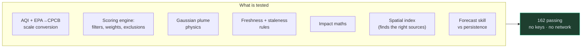

Some tests exist specifically to stop a past bug returning: that a stale reading
can reach the ranking, that a hospital can be recommended, that the wind
convention is not silently reversed, that a "skill" score can report failure.

---

## 16. Scalability

The scoring engine was measured, not guessed. Sources are placed into a grid of
~27 km squares when the app starts, so a query only ever looks at the handful of
squares around the hotspot — never the whole country.

| Registry size | Sources actually examined |
|---|---|
| 5,000 | 204 |
| 1,000,000 | 1,307 |

**200 times more data leads to only about 6 times more work.** This is what makes
a national rollout (India's 900+ stations) realistic. The grid also fixed a
correctness bug: looking sources up by city name missed nearby sources filed
under a *neighbouring* city, even though pollution ignores city borders. The grid
follows the air, not the paperwork.

What still needs work for a true national deployment is documented honestly in
`SCALABILITY.md`: the in-memory caches, the file-based registry, and the static
city list would all be replaced with a proper database and shared cache.

---

## 17. Known limits, stated honestly

We list these ourselves rather than let a reviewer discover them:

- **City-level, not ward-level.** The system works on 84 city monitoring points.
  The problem statement's ideal is 1 km grid resolution.
- **No emission-rate data.** The physics treats every source as emitting equally,
  so it targets, but does not measure pollution in μg/m³.
- **OpenStreetMap is a proxy**, not an official pollution register (which is not
  public). This caveat travels with the data itself.
- **Monsoon-season readings are genuinely low** right now — that is the freshness
  fix working, and the true severe readings return in winter.
- **Two cities (Ambala, Rajahmundry) are not yet seeded** with sources; they show
  on the map but are flagged "AQI-only" in enforcement rather than breaking.
- **No comparative dashboard or vulnerability-mapping layer** yet, though the
  hospital/school data needed for the latter already exists in the registry.

---

*This document describes the system as built. For the visual architecture
diagrams alone, see [`ARCHITECTURE.md`](ARCHITECTURE.md); for the scalability
numbers and rollout plan, [`SCALABILITY.md`](../SCALABILITY.md); for status and
gotchas, [`HANDOFF.md`](../HANDOFF.md).*
