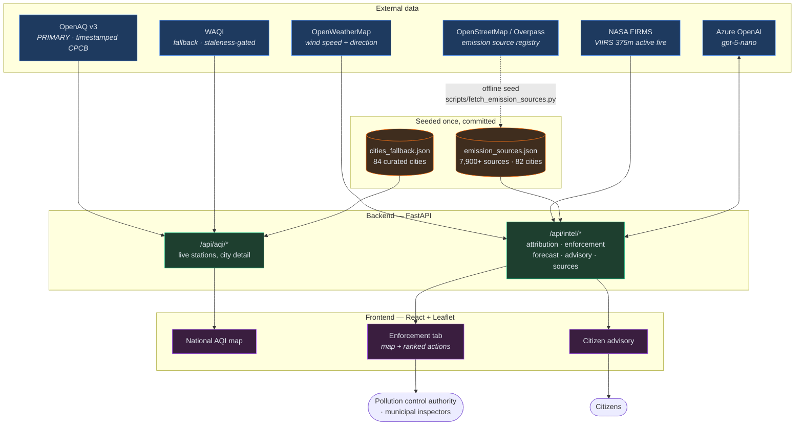
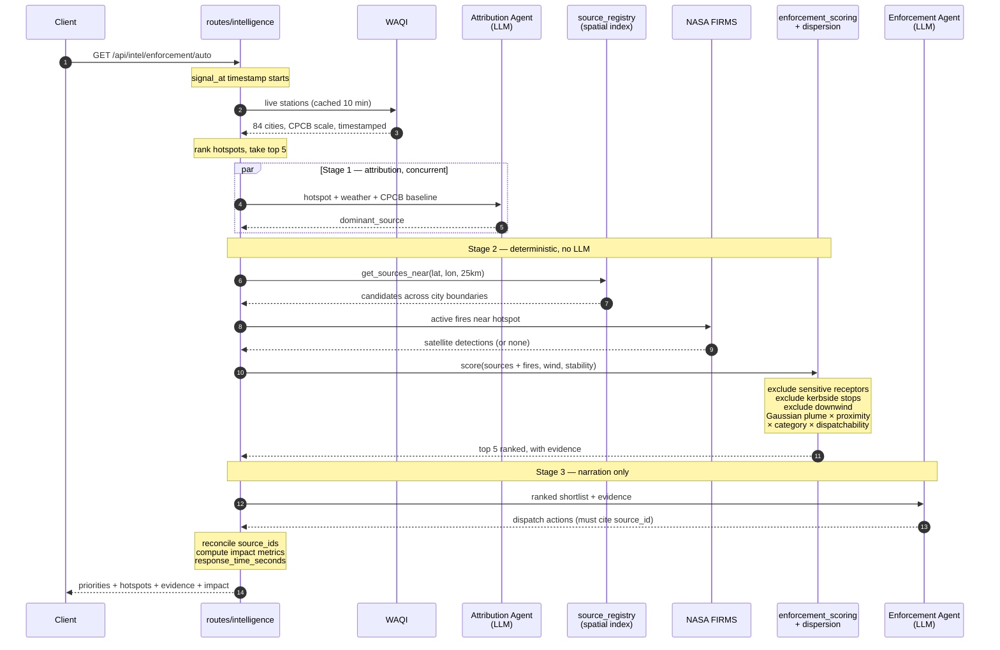
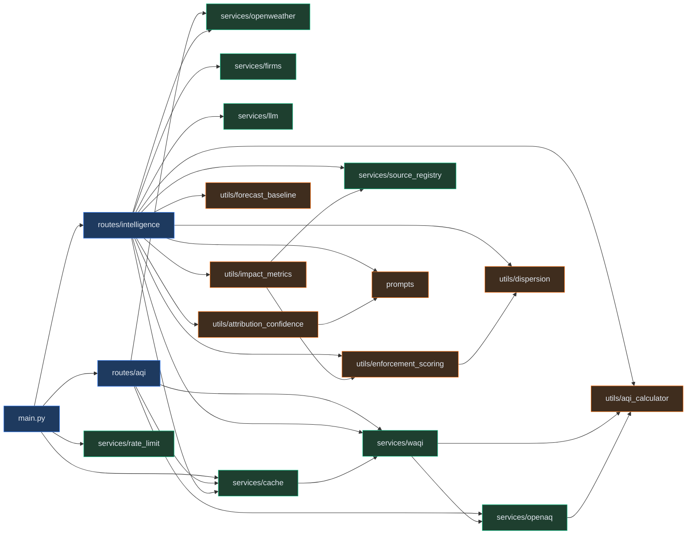
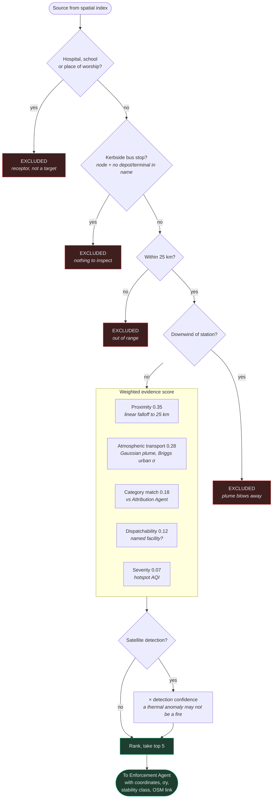
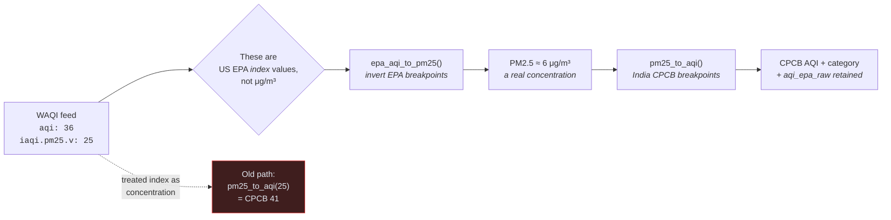
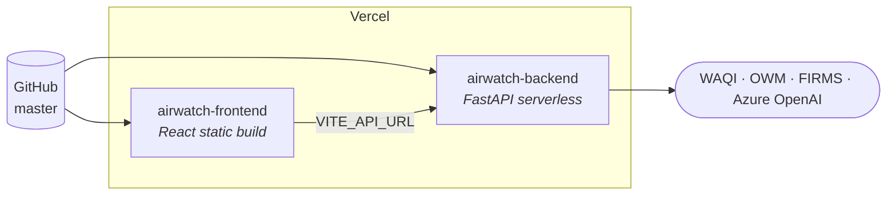

# AirWatch India — Architecture

Diagrams render natively on GitHub. The module graph below is extracted from the
actual imports in `backend/`, not drawn from memory.

---

## 1. System context

Where data comes from, what the platform does with it, who consumes the result.

---

## 2. The enforcement chain

The core of the project. Note where the LLM sits: **last**, and only to narrate a
shortlist it cannot alter.

---

## 3. Module dependency graph

Extracted from the `import` statements in `backend/`.

`utils/` has no dependency on `services/` except `impact_metrics`, which needs the
registry to compute a denominator. That keeps the scoring and dispersion logic
free of I/O, which is why 162 tests run without network access or API keys.

---

## 4. Evidence scoring pipeline

What happens to a single candidate source.

---

## 5. AQI scale conversion

Why every reading passes through a conversion before use.

Live stations arrived on the EPA scale while static fallback cities sat on CPCB,
and the **hotspot ranking sorted both together** — so the top-5 feeding the entire
enforcement chain was ranked on mixed units. Mid-range readings were distorted
roughly 4×: an EPA index of 100 (truly "Satisfactory", 35.4 μg/m³) rendered as
CPCB 234 "Poor".

---

## 6. Deployment

> ⚠️ Vercel builds from `master`. The enforcement work is on
> `feature/enforcement-intelligence` — **merge before demoing**, or the live URL
> serves none of it.

Per-process in-memory caches and the rate limiter do not survive serverless
invocation boundaries. See [SCALABILITY.md](../SCALABILITY.md) for what that costs
and what would replace them.
